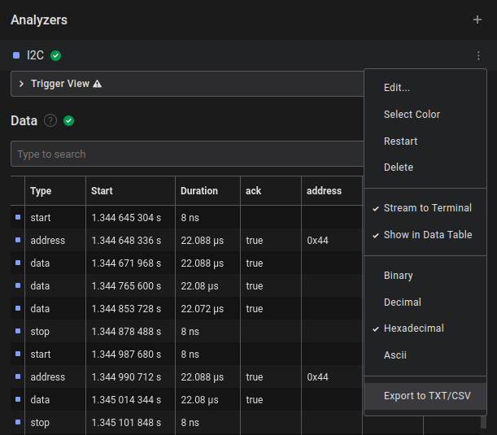
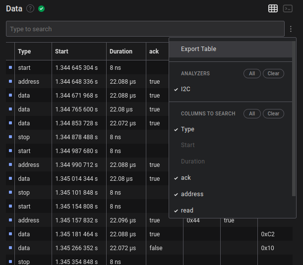

# Saleae-Parser

A Python script that makes Saleae Logic 2 App export data more useful.

Features:
* Filter by column
* Filter by hex data value
* Display lines before and after data filter

Special Features:
* Output CAN messages by ID and data
* Convert SPI flash chip read sessions into SRecords*
* Filter by I2C address

*\* if device is supported*

## Prerequisites
* Saleae Logic 2 output file txt/csv
* Python 3

**Note:**
The script has been built to parse [Saleae Logic 2](https://www.saleae.com/downloads/) output files. The script is not guarenteed to work with the output files generated using older versions of their software.

## Usage

### Generating Output in Saleae Logic 2

There are two ways to export data from a Saleae capture:
1. Export using a specific analyzer
2. Export the entire table (may include multiple analyzers)

It does not matter if the output file is a `*.txt` file or a `*.csv` file. They essentially are the same, as they will both be comma seperated ASCII files.

#### Single Analyzer



#### Table



### Running the script

`python3 <path_to_output_file>`

You may use the `-h` flag to see the various options that are available.

The output will be written to stdout.  Use the `>` or `>>` characters to send the output to a file.

### Examples

#### Filtering on a specific hex data value `0xC0` of I2C capture:

`python3 saleae_parser.py -z i2c -d c0 ../single_analz_i2c.txt`

```
['Time [s]', 'Packet ID', 'Address', 'Data', 'Read/Write', 'ACK/NAK']

['1.464694864000000', '0', '0x44', '0xC0', 'Read', 'ACK']
['1.517933240000000', '0', '0x44', '0xC0', 'Read', 'ACK']
['1.638685384000000', '0', '0x44', '0xC0', 'Read', 'ACK']
['1.639397880000000', '0', '0x44', '0xC0', 'Read', 'ACK']
['1.639720760000000', '0', '0x44', '0xC0', 'Write', 'ACK']
['1.940704480000000', '0', '0x44', '0xC0', 'Read', 'ACK']
['1.993914784000000', '0', '0x44', '0xC0', 'Read', 'ACK']
['2.114662928000000', '0', '0x44', '0xC0', 'Read', 'ACK']
['2.115396424000000', '0', '0x44', '0xC0', 'Read', 'ACK']
['2.115641056000000', '0', '0x44', '0xC0', 'Write', 'ACK']
['2.416652360000000', '0', '0x44', '0xC0', 'Read', 'ACK']
['2.469572824000000', '0', '0x44', '0xC0', 'Read', 'ACK']
['2.590632712000000', '0', '0x44', '0xC0', 'Read', 'ACK']
['2.591345208000000', '0', '0x44', '0xC0', 'Read', 'ACK']
['2.591670592000000', '0', '0x44', '0xC0', 'Write', 'ACK']
['2.891638544000000', '0', '0x44', '0xC0', 'Read', 'ACK']
['2.944566496000000', '0', '0x44', '0xC0', 'Read', 'ACK']
['3.065627136000000', '0', '0x44', '0xC0', 'Read', 'ACK']
['3.066354128000000', '0', '0x44', '0xC0', 'Read', 'ACK']
['3.066656264000000', '0', '0x44', '0xC0', 'Write', 'ACK']
```

#### Filtering on a specific hex data value including `2` lines before and `3` after of I2C capture:

`python3 saleae_parser.py -z i2c -d c0 -b 2 -a 3 ../single_analz_i2c.txt`

```
['Time [s]', 'Packet ID', 'Address', 'Data', 'Read/Write', 'ACK/NAK']

['1.434781776000000', '0', '0x44', '0x10', 'Read', 'NAK']
['1.464532992000000', '0', '0x44', '0x01', 'Write', 'ACK']
['1.464694864000000', '0', '0x44', '0xC0', 'Read', 'ACK']
['1.464736992000000', '0', '0x44', '0x90', 'Read', 'NAK']
['1.464893864000000', '0', '0x44', '0x00', 'Write', 'ACK']
['1.465059240000000', '0', '0x44', '0x01', 'Read', 'ACK']

['1.517600752000000', '0', '0x41', '0x5E', 'Read', 'NAK']
['1.517767864000000', '0', '0x44', '0x01', 'Write', 'ACK']
['1.517933240000000', '0', '0x44', '0xC0', 'Read', 'ACK']
['1.518015120000000', '0', '0x44', '0x10', 'Read', 'NAK']
['1.518191240000000', '0', '0x44', '0x01', 'Write', 'ACK']
['1.518273368000000', '0', '0x44', '0xC2', 'Write', 'ACK']

['1.608731792000000', '0', '0x44', '0x10', 'Read', 'NAK']
['1.638541256000000', '0', '0x44', '0x01', 'Write', 'ACK']
['1.638685384000000', '0', '0x44', '0xC0', 'Read', 'ACK']
['1.638727264000000', '0', '0x44', '0x90', 'Read', 'NAK']
['1.638884632000000', '0', '0x44', '0x00', 'Write', 'ACK']
['1.639028760000000', '0', '0x44', '0x01', 'Read', 'ACK']

...
```

#### Using the special CAN output for a CAN analyzer capture:

`python3 saleae_parser.py -z can --can ../export_table_can.csv > can.txt`

```
CAN Special Output
ID: 0x0000000000000100  Count:115939
ID: 0x0000000000000102  Count:16943

0x0000000000000102
0x62   |   b
0x64   |   d
0x37   |   7
0x63   |   c
0x30   |   0
0x34   |   4
0x37   |   7
0x64   |   d

0x0000000000000101
0x63   |   c
0x65   |   e
0x32   |   2
0x30   |   0
0x62   |   b
0x35   |   5
0x31   |   1
0x39   |   9

...
```

#### Output a single column from a SPI analyzer capture:

`python3 saleae_parser.py -z spi -f MOSI ../single_analz_spi.txt`

```
0x50
0x0F
0x40
0x08
0xB0
0x0F
0x40
0x0F
0x50
0x0F
0x40
0x08
0xC0

...
```

## Contributing

Any contribution is welcome either to fix bugs or to add functionality and additional analyzers to the script.  Please submit a pull request if you would like to contribute.

## Authors
Justin Cox

## License

See `LICENSE` and `NOTICE.txt` for additional information.
